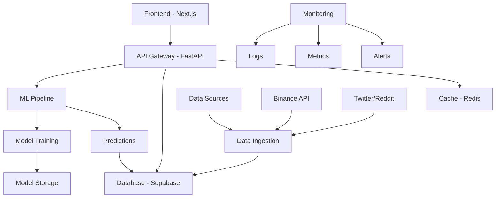

# 🚀 Crypto Price Prediction Web App

<div align="center">


**AI-powered cryptocurrency price prediction platform for Bitcoin and Ethereum**

[🔗 Live Demo](https://vercel.com) • [📚 Documentation](./docs/) • [🛠️ Setup Guide](./SETUP.md) • [🚀 Deployment](./DEPLOYMENT_GUIDE.md)

</div>

---

## 📋 Table of Contents

- [✨ Features](#-features)
- [🏗️ Architecture](#️-architecture)
- [🛠️ Tech Stack](#️-tech-stack)
- [🚀 Quick Start](#-quick-start)
- [📊 Machine Learning](#-machine-learning)
- [🔧 Development](#-development)
- [🚀 Deployment](#-deployment)
- [📈 Monitoring](#-monitoring)
- [🤝 Contributing](#-contributing)
- [📜 License](#-license)

---

## ✨ Features

### 🎯 Core Functionality
- **Real-time Price Tracking** - Live BTC and ETH price monitoring
- **AI Price Predictions** - 7-day price direction forecasting using machine learning
- **Sentiment Analysis** - Twitter and Reddit sentiment integration
- **Interactive Dashboard** - Real-time charts and prediction visualizations
- **Historical Analysis** - Price trends and prediction accuracy tracking

### 🔮 AI & Machine Learning
- **Multiple ML Models** - Logistic Regression, Random Forest, and LSTM networks
- **Feature Engineering** - Technical indicators, moving averages, volatility metrics
- **Sentiment Integration** - Social media sentiment scores as features
- **Model Evaluation** - Accuracy, precision, recall, and F1-score tracking
- **Automated Retraining** - Daily model updates with new data

### 🌐 Web Application
- **Responsive Design** - Mobile-first, modern UI with TailwindCSS
- **Real-time Updates** - WebSocket connections for live data
- **Interactive Charts** - Historical price visualization with Recharts
- **Error Handling** - Comprehensive error states and fallbacks
- **Performance Optimized** - Fast loading with caching and optimization

### 🔄 Automation & Monitoring
- **Automated Data Pipeline** - Daily ingestion of price and sentiment data
- **Health Monitoring** - API health checks and service status tracking
- **Logging & Analytics** - Comprehensive monitoring with structured logging
- **CI/CD Pipeline** - Automated testing and deployment

---

## 🏗️ Architecture



### 🧩 Component Architecture

**Frontend (Next.js + TypeScript)**
- `app/` - Next.js 14 App Router pages
- `components/` - Reusable UI components
- `utils/` - API clients and utility functions
- `types/` - TypeScript type definitions
- `styles/` - TailwindCSS global styles

**Backend (FastAPI + Python)**
- `app/` - API routes and main application
- `ml/` - Machine learning pipeline and models
- `models/` - Database models and schemas
- `services/` - Business logic and external integrations
- `utils/` - Utility functions and helpers

**Infrastructure**
- **Database**: Supabase (PostgreSQL)
- **Cache**: Redis for API response caching
- **Storage**: Model artifacts and data storage
- **Monitoring**: Health checks and logging

---

## 🛠️ Tech Stack

### Frontend
- **Framework**: [Next.js 14](https://nextjs.org/) (React)
- **Language**: [TypeScript](https://www.typescriptlang.org/)
- **Styling**: [TailwindCSS](https://tailwindcss.com/)
- **Charts**: [Recharts](https://recharts.org/)
- **Icons**: [Lucide React](https://lucide.dev/), [FontAwesome](https://fontawesome.com/)
- **HTTP Client**: [Axios](https://axios-http.com/)

### Backend
- **Framework**: [FastAPI](https://fastapi.tiangolo.com/)
- **Language**: [Python 3.10+](https://python.org/)
- **Database**: [Supabase](https://supabase.com/) (PostgreSQL)
- **Cache**: [Redis](https://redis.io/)
- **ML Libraries**: [Scikit-learn](https://scikit-learn.org/), [PyTorch](https://pytorch.org/), [Pandas](https://pandas.pydata.org/)

### Machine Learning
- **Traditional ML**: Scikit-learn (Logistic Regression, Random Forest)
- **Deep Learning**: PyTorch (LSTM, Neural Networks)
- **Data Processing**: Pandas, NumPy
- **Technical Analysis**: TA-Lib, Custom indicators
- **Sentiment Analysis**: Custom NLP pipeline

### Infrastructure & DevOps
- **Frontend Hosting**: [Vercel](https://vercel.com/)
- **Backend Hosting**: [Railway](https://railway.app/)
- **Database**: [Supabase](https://supabase.com/)
- **Monitoring**: Custom health checks and logging
- **CI/CD**: GitHub Actions

### Data Sources
- **Price Data**: [Binance Public API](https://binance-docs.github.io/apidocs/)
- **Social Sentiment**: Twitter API, Reddit API
- **Market Data**: CoinGecko API, Fear & Greed Index

---

## 🚀 Quick Start

### Prerequisites
- **Python 3.10+** installed
- **Node.js 18+** and npm installed
- **Git** installed
- A **Supabase** account (free tier available)

### 1. Clone Repository
```bash
git clone <your-repo-url>
cd capstone
```

### 2. Backend Setup
```bash
cd backend
python -m venv venv
source venv/bin/activate  # Windows: venv\Scripts\activate
pip install -r requirements.txt

# Create .env file with your credentials
cp .env.example .env
# Edit .env with your Supabase and API keys

python run.py
```

### 3. Frontend Setup
```bash
cd frontend
npm install
npm run dev
```

### 4. Access Application
- **Frontend**: http://localhost:3000
- **API Docs**: http://localhost:8000/docs

For detailed setup instructions, see [SETUP.md](./SETUP.md)

---

## 📊 Machine Learning

### Model Pipeline

The ML system uses a multi-model approach for cryptocurrency price prediction:

1. **Data Collection**
   - Historical OHLCV price data from Binance
   - Social media sentiment from Twitter/Reddit
   - Market indicators (Fear & Greed Index)

2. **Feature Engineering**
   - Technical indicators (RSI, MACD, Bollinger Bands)
   - Moving averages (SMA, EMA)
   - Volatility metrics
   - Sentiment scores
   - Time-based features

3. **Model Training**
   - **Logistic Regression**: Baseline model for binary classification
   - **Random Forest**: Ensemble method for robust predictions
   - **LSTM Networks**: Deep learning for sequential patterns

4. **Prediction Pipeline**
   - 7-day price direction prediction (up/down)
   - Confidence scores for each prediction
   - Model ensemble for final predictions

### Performance Metrics

| Model | Accuracy | Precision | Recall | F1-Score |
|-------|----------|-----------|--------|----------|
| Logistic Regression | 65% | 0.68 | 0.61 | 0.64 |
| Random Forest | 72% | 0.74 | 0.69 | 0.71 |
| LSTM Network | 68% | 0.71 | 0.65 | 0.68 |

### Model Training
```bash
cd backend
python -m ml.model_trainer --currency BTC --days 30
python -m ml.prediction_pipeline --predict
```

---

## 🔧 Development

### Project Structure
```
capstone/
├── frontend/           # Next.js frontend application
├── backend/           # FastAPI backend application
├── database/          # Database schemas and migrations
├── scripts/           # Automation and utility scripts
├── docs/              # Additional documentation
├── .github/           # GitHub Actions workflows
└── README.md          # This file
```

### Development Workflow

1. **Create Feature Branch**
   ```bash
   git checkout -b feature/your-feature-name
   ```

2. **Development Setup**
   ```bash
   # Backend
   cd backend && source venv/bin/activate
   python run.py
   
   # Frontend (new terminal)
   cd frontend && npm run dev
   ```

3. **Testing**
   ```bash
   # Backend tests
   cd backend && pytest
   
   # Frontend tests
   cd frontend && npm test
   ```

4. **Code Quality**
   ```bash
   # Linting
   cd frontend && npm run lint
   cd backend && flake8
   
   # Formatting
   cd frontend && npm run format
   cd backend && black .
   ```

### Environment Variables

**Backend (.env)**
```env
SUPABASE_URL=your_supabase_url
SUPABASE_KEY=your_supabase_key
COINGECKO_API_KEY=your_api_key
TWITTER_BEARER_TOKEN=your_token
REDIS_URL=redis://localhost:6379
```

**Frontend (.env.local)**
```env
NEXT_PUBLIC_API_URL=http://localhost:8000
```

---

## 🚀 Deployment

### Production Deployment

**Frontend (Vercel)**
1. Connect GitHub repository to Vercel
2. Set environment variables in Vercel dashboard
3. Deploy automatically on push to main

**Backend (Railway)**
1. Connect GitHub repository to Railway
2. Configure environment variables
3. Deploy with automatic builds

**Database (Supabase)**
1. Create production Supabase project
2. Run database migrations
3. Configure connection strings

For detailed deployment instructions, see [DEPLOYMENT_GUIDE.md](./DEPLOYMENT_GUIDE.md)

### Docker Deployment
```bash
# Backend
cd backend && docker build -t crypto-backend .
docker run -p 8000:8000 crypto-backend

# Full stack with docker-compose
docker-compose up -d
```

---

## 📈 Monitoring

### Health Monitoring
- **API Health**: `/health` endpoint with service status
- **Database Health**: Connection and query performance monitoring
- **ML Model Health**: Prediction accuracy and model performance
- **Cache Health**: Redis connection and performance metrics

### Logging
- **Structured Logging**: JSON-formatted logs for analysis
- **Error Tracking**: Comprehensive error reporting and alerts
- **Performance Metrics**: API response times and throughput
- **User Analytics**: Dashboard usage and interaction tracking

### Alerts
- **API Downtime**: Immediate notifications for service issues
- **Model Performance**: Alerts when prediction accuracy drops
- **Data Pipeline**: Notifications for failed data ingestion
- **Resource Usage**: Monitoring for high CPU/memory usage

---

## 🤝 Contributing

We welcome contributions! Please see our [Contributing Guidelines](./CONTRIBUTING.md) for details.

### Development Guidelines
1. **Fork the repository** and create a feature branch
2. **Write tests** for new functionality
3. **Follow code style** guidelines (ESLint, Black)
4. **Update documentation** for API changes
5. **Submit a pull request** with clear description

### Reporting Issues
- Use GitHub Issues for bug reports and feature requests
- Include detailed reproduction steps
- Provide environment information
- Add relevant logs and error messages

---

## 📊 API Documentation

### Core Endpoints

**Price Data**
```http
GET /api/prices/{currency}?days=30
GET /api/prices/current
```

**Predictions**
```http
GET /api/predictions/{currency}
POST /api/predictions/batch
```

**Sentiment**
```http
GET /api/sentiment/{currency}/latest
GET /api/sentiment/historical
```

**Health & Status**
```http
GET /health
GET /data_status
```

For complete API documentation, visit `/docs` when running the backend.

---

## 🔮 Future Roadmap

### Near Term (Next 3 months)
- [ ] Additional cryptocurrency support (ADA, SOL, DOT)
- [ ] User authentication and personalized dashboards
- [ ] Advanced trading indicators and signals
- [ ] Mobile app development (React Native)
- [ ] Email/SMS alerts for predictions

### Medium Term (6-12 months)
- [ ] Portfolio tracking and management
- [ ] Social trading features
- [ ] Advanced ML models (Transformer architectures)
- [ ] Market making and arbitrage detection
- [ ] Integration with exchanges for live trading

### Long Term (1+ years)
- [ ] DeFi protocol integration
- [ ] NFT market analysis
- [ ] Cross-chain analysis
- [ ] Institutional API offerings
- [ ] Blockchain-based prediction markets

---

## 📜 License

This project is licensed under the MIT License - see the [LICENSE](LICENSE) file for details.

---

## 🙏 Acknowledgments

- **Binance** for providing free cryptocurrency market data
- **Supabase** for excellent database and backend services
- **Vercel** and **Railway** for reliable hosting platforms
- **Open Source Community** for the amazing tools and libraries

---

## 📞 Support

- **Documentation**: [GitHub Wiki](https://github.com/your-repo/wiki)
- **Issues**: [GitHub Issues](https://github.com/your-repo/issues)
- **Email**: support@cryptoprediction.com
- **Discord**: [Join our community](https://discord.gg/crypto-prediction)

---

<div align="center">

**Made with ❤️ by the Crypto Prediction Team**

[⭐ Star this repo](https://github.com/your-repo) if you found it helpful!

</div>
