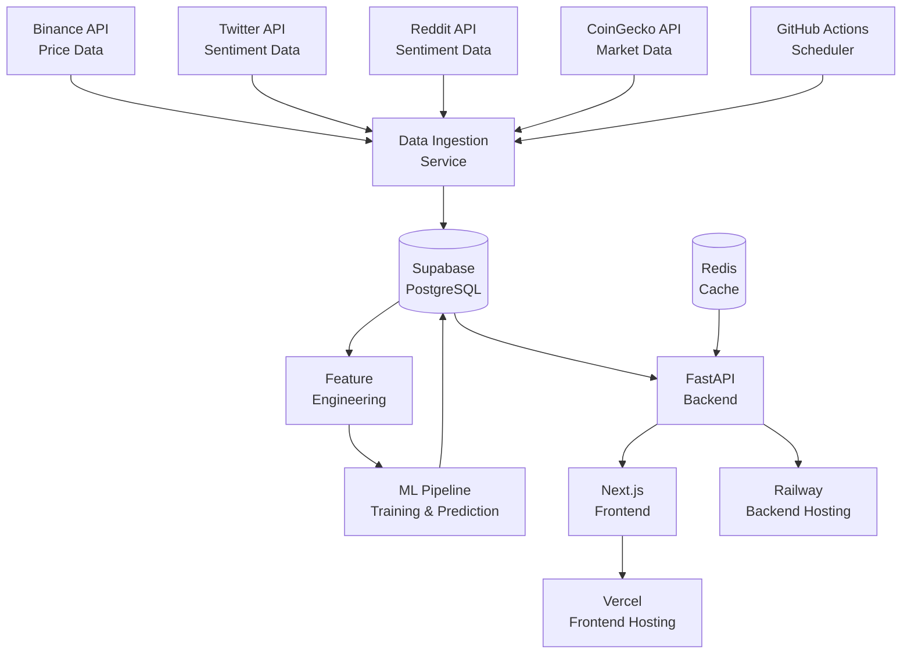
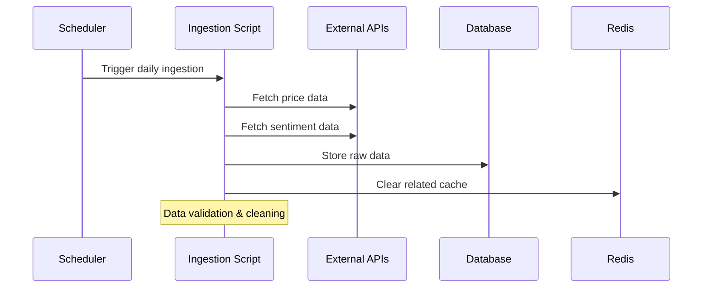
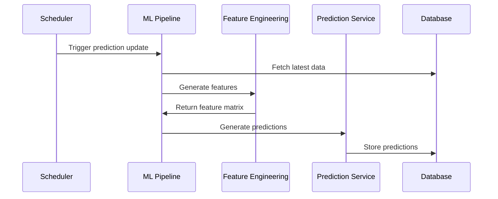
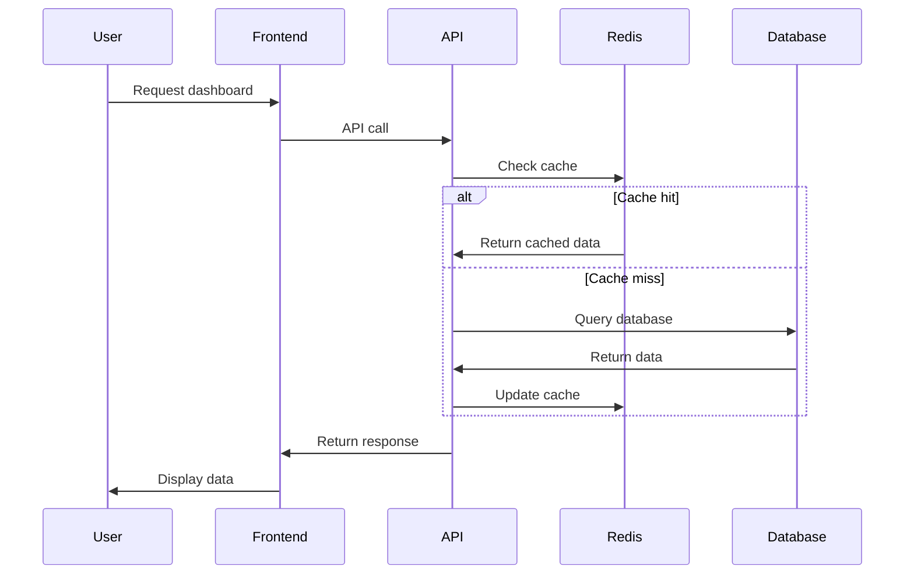
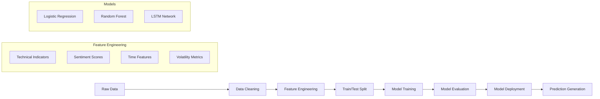
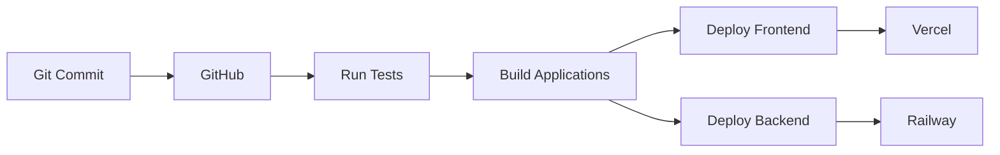

# 🏗️ System Architecture

This document provides a comprehensive overview of the Crypto Price Prediction system architecture, design decisions, and technical implementation details.

## 📋 Table of Contents

- [🎯 System Overview](#-system-overview)
- [🏢 High-Level Architecture](#-high-level-architecture)
- [🧩 Component Architecture](#-component-architecture)
- [📊 Data Flow](#-data-flow)
- [🔄 Machine Learning Pipeline](#-machine-learning-pipeline)
- [🗄️ Database Design](#️-database-design)
- [🌐 API Architecture](#-api-architecture)
- [🎨 Frontend Architecture](#-frontend-architecture)
- [⚡ Performance Considerations](#-performance-considerations)
- [🔒 Security Architecture](#-security-architecture)

---

## 🎯 System Overview

The Crypto Price Prediction system is a full-stack web application that uses machine learning to predict cryptocurrency price movements. The system is designed with the following principles:

- **Scalability**: Handle increasing data volume and user load
- **Reliability**: Ensure high availability and fault tolerance
- **Maintainability**: Clean code structure and comprehensive documentation
- **Performance**: Fast response times and efficient resource usage
- **Security**: Secure data handling and API access

### Core Components

1. **Frontend**: Next.js React application with TypeScript
2. **Backend**: FastAPI Python application with ML pipeline
3. **Database**: Supabase (PostgreSQL) for data storage
4. **Cache**: Redis for performance optimization
5. **ML Pipeline**: Automated model training and prediction generation

---

## 🏢 High-Level Architecture



---

## 🧩 Component Architecture

### Frontend (Next.js)

```
frontend/
├── app/                    # Next.js 14 App Router
│   ├── page.tsx           # Dashboard homepage
│   ├── layout.tsx         # Root layout component
│   └── status/            # Status page
├── components/            # Reusable UI components
│   ├── Dashboard.tsx      # Main dashboard component
│   ├── PriceCard.tsx      # Price display component
│   ├── PredictionCard.tsx # Prediction display component
│   ├── PriceChart.tsx     # Chart visualization
│   └── Navbar.tsx         # Navigation component
├── utils/                 # Utility functions
│   └── api.ts            # API client configuration
├── types/                 # TypeScript type definitions
├── styles/               # Global styles and Tailwind config
└── hooks/                # Custom React hooks
```

**Key Features:**
- Server-side rendering for performance
- Responsive design with TailwindCSS
- Real-time data updates
- Component-based architecture
- TypeScript for type safety

### Backend (FastAPI)

```
backend/
├── app/                   # Main application code
│   ├── main.py           # FastAPI application entry point
│   ├── database.py       # Database connection and models
│   ├── api/              # API route handlers
│   ├── services/         # Business logic services
│   ├── models/           # Database models
│   └── utils/            # Utility functions
├── ml/                   # Machine learning pipeline
│   ├── prediction_pipeline.py
│   ├── model_trainer.py
│   ├── feature_engineering.py
│   └── data_preprocessor.py
├── scripts/              # Automation scripts
└── tests/               # Test suite
```

**Key Features:**
- Async/await for high performance
- Automatic API documentation
- Dependency injection
- Database ORM integration
- Comprehensive error handling

---

## 📊 Data Flow

### 1. Data Ingestion Flow



### 2. Prediction Generation Flow



### 3. User Request Flow



---

## 🔄 Machine Learning Pipeline

### Architecture Overview



### Components

1. **Data Preprocessor** (`data_preprocessor.py`)
   - Data cleaning and validation
   - Missing value handling
   - Outlier detection and treatment

2. **Feature Engineering** (`feature_engineering.py`)
   - Technical indicators (RSI, MACD, Bollinger Bands)
   - Moving averages (SMA, EMA)
   - Sentiment analysis integration
   - Time-based features

3. **Model Trainer** (`model_trainer.py`)
   - Multiple model training
   - Hyperparameter optimization
   - Model evaluation and comparison
   - Model serialization

4. **Prediction Pipeline** (`prediction_pipeline.py`)
   - Real-time prediction generation
   - Model ensemble methods
   - Confidence score calculation

---

## 🗄️ Database Design

### Core Tables

```sql
-- Price data for cryptocurrencies
CREATE TABLE crypto_prices (
    id UUID PRIMARY KEY DEFAULT gen_random_uuid(),
    currency VARCHAR(10) NOT NULL,
    timestamp TIMESTAMP WITH TIME ZONE NOT NULL,
    open DECIMAL(20, 8),
    high DECIMAL(20, 8),
    low DECIMAL(20, 8),
    close DECIMAL(20, 8),
    volume DECIMAL(20, 8),
    created_at TIMESTAMP DEFAULT NOW()
);

-- Sentiment analysis data
CREATE TABLE sentiment_data (
    id UUID PRIMARY KEY DEFAULT gen_random_uuid(),
    currency VARCHAR(10) NOT NULL,
    timestamp TIMESTAMP WITH TIME ZONE NOT NULL,
    twitter_sentiment DECIMAL(5, 4),
    reddit_sentiment DECIMAL(5, 4),
    fear_greed_index INTEGER,
    created_at TIMESTAMP DEFAULT NOW()
);

-- ML model predictions
CREATE TABLE predictions (
    id UUID PRIMARY KEY DEFAULT gen_random_uuid(),
    currency VARCHAR(10) NOT NULL,
    prediction_date DATE NOT NULL,
    target_date DATE NOT NULL,
    prediction INTEGER, -- 0 for down, 1 for up
    confidence DECIMAL(5, 4),
    model_version VARCHAR(50),
    actual_result INTEGER, -- filled after target_date
    created_at TIMESTAMP DEFAULT NOW()
);

-- Model training metrics
CREATE TABLE model_metrics (
    id UUID PRIMARY KEY DEFAULT gen_random_uuid(),
    model_name VARCHAR(100) NOT NULL,
    currency VARCHAR(10) NOT NULL,
    training_date TIMESTAMP DEFAULT NOW(),
    accuracy DECIMAL(5, 4),
    precision_score DECIMAL(5, 4),
    recall_score DECIMAL(5, 4),
    f1_score DECIMAL(5, 4),
    model_params JSONB
);
```

### Indexing Strategy

```sql
-- Performance indexes for common queries
CREATE INDEX idx_crypto_prices_currency_timestamp ON crypto_prices(currency, timestamp);
CREATE INDEX idx_sentiment_currency_timestamp ON sentiment_data(currency, timestamp);
CREATE INDEX idx_predictions_currency_date ON predictions(currency, prediction_date);
CREATE INDEX idx_predictions_target_date ON predictions(target_date);
```

---

## 🌐 API Architecture

### RESTful Endpoints

```python
# Core API structure
/api/v1/
├── /health                    # Health check
├── /prices/                   # Price data endpoints
│   ├── /current              # Current prices
│   ├── /{currency}           # Historical prices
│   └── /historical           # Bulk historical data
├── /predictions/             # Prediction endpoints
│   ├── /{currency}           # Get predictions
│   ├── /batch                # Batch predictions
│   └── /accuracy             # Prediction accuracy
├── /sentiment/               # Sentiment endpoints
│   ├── /{currency}/latest    # Latest sentiment
│   └── /historical           # Historical sentiment
└── /models/                  # Model management
    ├── /metrics              # Model performance
    ├── /retrain              # Trigger retraining
    └── /status               # Training status
```

### Response Format

```json
{
  "success": true,
  "data": {
    // Response data
  },
  "metadata": {
    "timestamp": "2024-01-01T00:00:00Z",
    "request_id": "uuid",
    "version": "1.0.0"
  },
  "pagination": {
    "page": 1,
    "limit": 50,
    "total": 1000,
    "has_next": true
  }
}
```

---

## 🎨 Frontend Architecture

### Component Hierarchy

```
App (layout.tsx)
├── Navbar
├── Dashboard
│   ├── PriceCard (BTC)
│   ├── PriceCard (ETH)
│   ├── PredictionCard (BTC)
│   ├── PredictionCard (ETH)
│   ├── PriceChart (BTC)
│   └── PriceChart (ETH)
└── StatusPage
```

### State Management

- **Local State**: React useState for component-specific state
- **Server State**: API calls with automatic caching
- **Global State**: React Context for shared application state

### Performance Optimizations

- **Code Splitting**: Dynamic imports for route-based splitting
- **Image Optimization**: Next.js automatic image optimization
- **Caching**: API response caching with stale-while-revalidate
- **Lazy Loading**: Components and data loaded on demand

---

## ⚡ Performance Considerations

### Backend Performance

1. **Database Optimization**
   - Proper indexing for query performance
   - Connection pooling
   - Query optimization

2. **Caching Strategy**
   - Redis for API response caching
   - Cache invalidation on data updates
   - TTL-based cache expiration

3. **Async Processing**
   - FastAPI async/await for I/O operations
   - Background tasks for long-running operations
   - Connection pooling for external APIs

### Frontend Performance

1. **Bundle Optimization**
   - Tree shaking for unused code elimination
   - Code splitting for smaller bundles
   - Compression and minification

2. **Rendering Optimization**
   - Server-side rendering for initial load
   - Static generation where possible
   - Efficient re-rendering with React optimizations

3. **Data Loading**
   - SWR for data fetching and caching
   - Incremental data loading
   - Optimistic updates

---

## 🔒 Security Architecture

### API Security

- **Authentication**: API key-based authentication for external APIs
- **Rate Limiting**: Prevent API abuse with rate limiting
- **Input Validation**: Comprehensive input validation and sanitization
- **CORS**: Proper CORS configuration for cross-origin requests

### Data Security

- **Environment Variables**: Sensitive data stored in environment variables
- **Database Security**: Connection encryption and secure credentials
- **API Keys**: Secure storage and rotation of API keys
- **Logging**: Secure logging without sensitive data exposure

### Infrastructure Security

- **HTTPS**: SSL/TLS encryption for all communications
- **Secrets Management**: Secure handling of secrets in deployment
- **Access Control**: Proper access controls for database and APIs
- **Monitoring**: Security monitoring and alerting

---

## 🔄 Deployment Architecture

### Development Environment

```
Local Development
├── Frontend: http://localhost:3000
├── Backend: http://localhost:8000
├── Database: Local Supabase instance
└── Cache: Local Redis instance
```

### Production Environment

```
Production Infrastructure
├── Frontend: Vercel (CDN + Edge Functions)
├── Backend: Railway (Container deployment)
├── Database: Supabase (Managed PostgreSQL)
├── Cache: Railway Redis (Managed Redis)
└── Monitoring: Custom health checks
```

### CI/CD Pipeline



---

This architecture supports the current requirements while providing flexibility for future enhancements and scaling needs. 